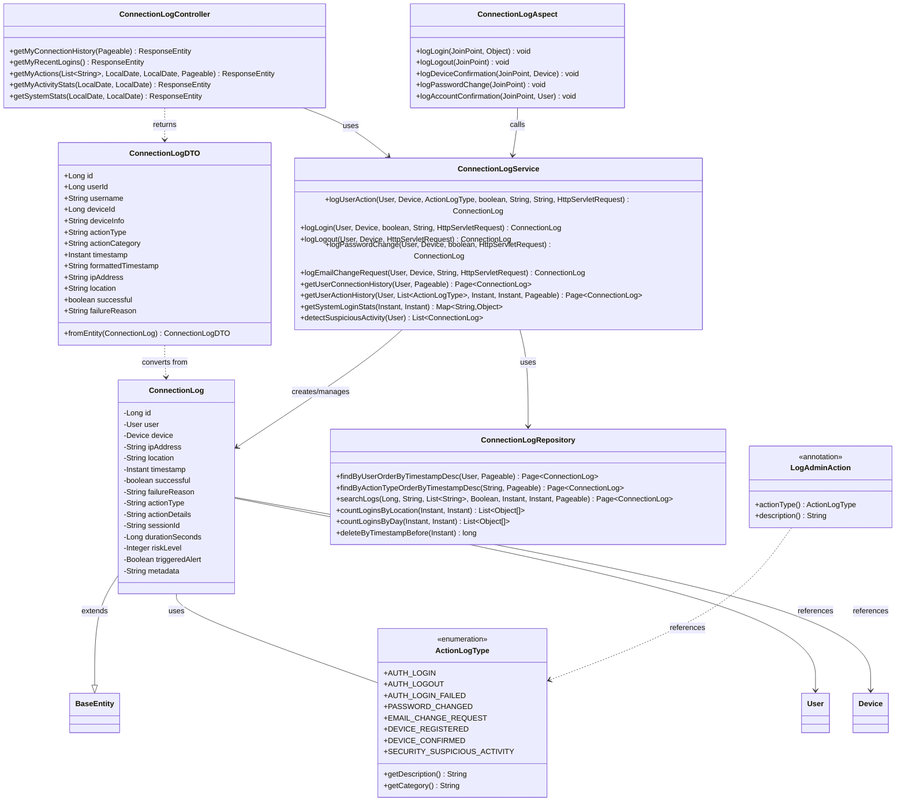
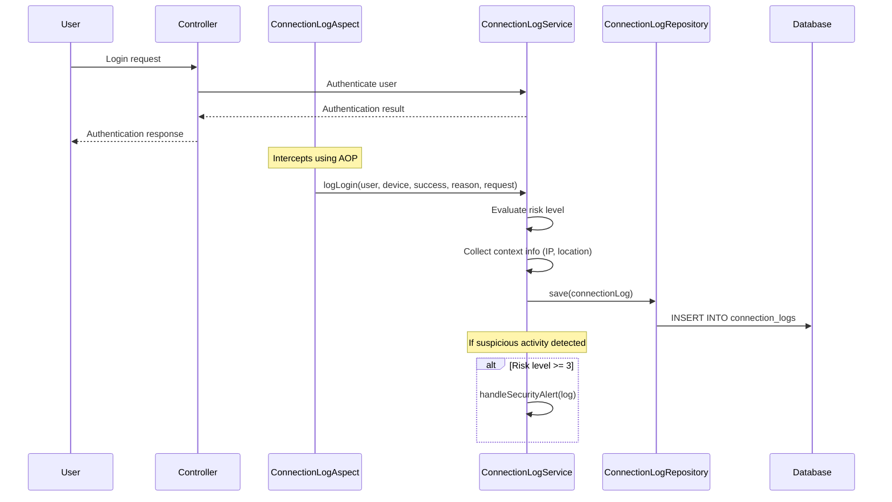
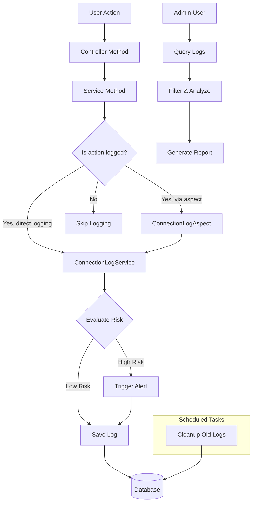

```mermaid
classDiagram
    class ConnectionLog {
        -Long id
        -User user
        -Device device
        -String ipAddress
        -String location
        -Instant timestamp
        -boolean successful
        -String failureReason
        -String actionType
        -String actionDetails
        -String sessionId
        -Long durationSeconds
        -Integer riskLevel
        -Boolean triggeredAlert
        -String metadata
    }
    
    class ActionLogType {
        <<enumeration>>
        +AUTH_LOGIN
        +AUTH_LOGOUT
        +AUTH_LOGIN_FAILED
        +PASSWORD_CHANGED
        +EMAIL_CHANGE_REQUEST
        +DEVICE_REGISTERED
        +DEVICE_CONFIRMED
        +SECURITY_SUSPICIOUS_ACTIVITY
        +getDescription() String
        +getCategory() String
    }
    
    class ConnectionLogDTO {
        +Long id
        +Long userId
        +String username
        +Long deviceId
        +String deviceInfo
        +String actionType
        +String actionCategory
        +Instant timestamp
        +String formattedTimestamp
        +String ipAddress
        +String location
        +boolean successful
        +String failureReason
        +fromEntity(ConnectionLog) ConnectionLogDTO
    }
    
    class ConnectionLogService {
        +logUserAction(User, Device, ActionLogType, boolean, String, String, HttpServletRequest) ConnectionLog
        +logLogin(User, Device, boolean, String, HttpServletRequest) ConnectionLog
        +logLogout(User, Device, HttpServletRequest) ConnectionLog
        +logPasswordChange(User, Device, boolean, HttpServletRequest) ConnectionLog
        +logEmailChangeRequest(User, Device, String, HttpServletRequest) ConnectionLog
        +getUserConnectionHistory(User, Pageable) Page~ConnectionLog~
        +getUserActionHistory(User, List~ActionLogType~, Instant, Instant, Pageable) Page~ConnectionLog~
        +getSystemLoginStats(Instant, Instant) Map~String,Object~
        +detectSuspiciousActivity(User) List~ConnectionLog~
    }
    
    class ConnectionLogController {
        +getMyConnectionHistory(Pageable) ResponseEntity
        +getMyRecentLogins() ResponseEntity
        +getMyActions(List~String~, LocalDate, LocalDate, Pageable) ResponseEntity
        +getMyActivityStats(LocalDate, LocalDate) ResponseEntity
        +getSystemStats(LocalDate, LocalDate) ResponseEntity
    }
    
    class ConnectionLogAspect {
        +logLogin(JoinPoint, Object) void
        +logLogout(JoinPoint) void
        +logDeviceConfirmation(JoinPoint, Device) void
        +logPasswordChange(JoinPoint) void
        +logAccountConfirmation(JoinPoint, User) void
    }
    
    class ConnectionLogRepository {
        +findByUserOrderByTimestampDesc(User, Pageable) Page~ConnectionLog~
        +findByActionTypeOrderByTimestampDesc(String, Pageable) Page~ConnectionLog~
        +searchLogs(Long, String, List~String~, Boolean, Instant, Instant, Pageable) Page~ConnectionLog~
        +countLoginsByLocation(Instant, Instant) List~Object[]~
        +countLoginsByDay(Instant, Instant) List~Object[]~
        +deleteByTimestampBefore(Instant) long
    }
    
    class LogAdminAction {
        <<annotation>>
        +actionType() ActionLogType
        +description() String
    }
    
    ConnectionLog --|> BaseEntity : extends
    ConnectionLog -- ActionLogType : uses
    ConnectionLog --> User : references
    ConnectionLog --> Device : references
    ConnectionLogDTO ..> ConnectionLog : converts from
    ConnectionLogService --> ConnectionLog : creates/manages
    ConnectionLogService --> ConnectionLogRepository : uses
    ConnectionLogController --> ConnectionLogService : uses
    ConnectionLogController ..> ConnectionLogDTO : returns
    ConnectionLogAspect --> ConnectionLogService : calls
    LogAdminAction ..> ActionLogType : references
```

```mermaid
sequenceDiagram
    participant User
    participant Controller
    participant Aspect as ConnectionLogAspect
    participant Service as ConnectionLogService
    participant Repository as ConnectionLogRepository
    participant DB as Database
    
    User->>Controller: Login request
    Controller->>Service: Authenticate user
    Service-->>Controller: Authentication result
    Controller-->>User: Authentication response
    
    Note over Aspect: Intercepts using AOP
    Aspect->>Service: logLogin(user, device, success, reason, request)
    Service->>Service: Evaluate risk level
    Service->>Service: Collect context info (IP, location)
    Service->>Repository: save(connectionLog)
    Repository->>DB: INSERT INTO connection_logs
    
    Note over Service: If suspicious activity detected
    alt Risk level >= 3
        Service->>Service: handleSecurityAlert(log)
    end
```

```mermaid
flowchart TB
    start[User Action] --> controller[Controller Method]
    controller --> service[Service Method]
    
    service --> isLogged{Is action logged?}
    
    isLogged -->|Yes, direct logging| logservice[ConnectionLogService]
    isLogged -->|Yes, via aspect| aspect[ConnectionLogAspect]
    isLogged -->|No| skip[Skip Logging]
    
    aspect --> logservice
    
    logservice --> risk{Evaluate Risk}
    risk -->|Low Risk| save[Save Log]
    risk -->|High Risk| alert[Trigger Alert]
    alert --> save
    
    save --> db[(Database)]
    
    admin[Admin User] --> query[Query Logs]
    query --> filter[Filter & Analyze]
    filter --> report[Generate Report]
    
    subgraph "Scheduled Tasks"
    cleanup[Cleanup Old Logs]
    end
    
    cleanup --> db
```